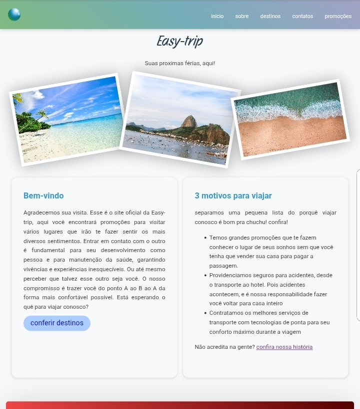
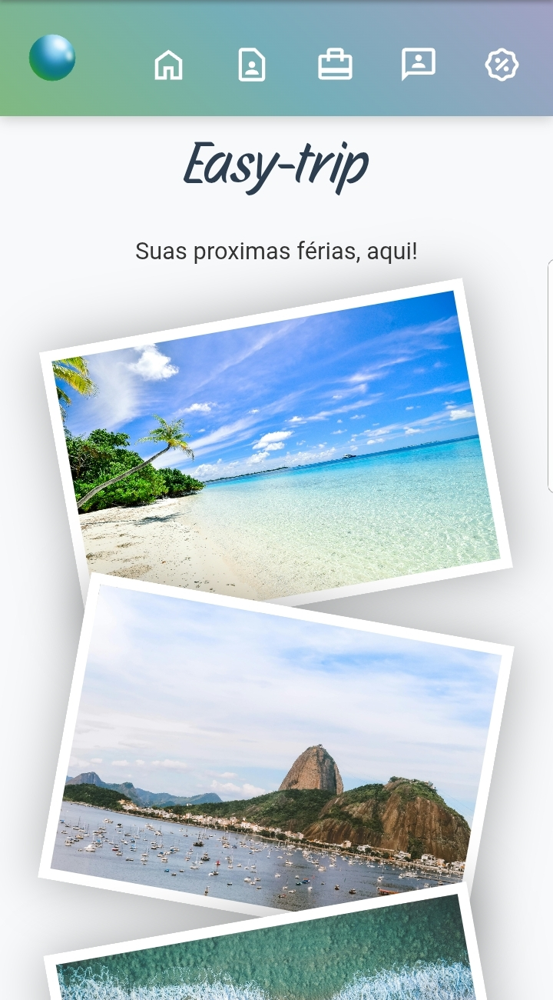

# agencia-de-viagens
um site estático de uma agencia de viagens fictícia chamada Easy-Trip. Qualquer marca de viagens que se chame "Easy-Trip" na vida rela é mera coincidência. E não está associada à essa Easy-Trip fictícia daqui.

Esse site possui o método de dessnvolvimento mobile-first com responsividade. Vale ressaltar que isso significa que coisas (como ícones) podem não estar visíveis de versão para versão. Isso por incrível que pareça foi pensado para ser assim e não se trata de um bug, conteúdo não usado ou qualquer coisa parecida, isso é só para o design não ficar com problemas de largura e posição de elementos na versão mobile (que ficariam bem presentes caso icones não forem usados)

# Imagens do site

# Páginas

Inicio
-

página inicial do site. nela o site daria boas vindas ao usuário e apresentaria as promoções mais recentes.

Sobre
-

uma página que conta um pouco da história da empresa. aqui eu fiz diferentes logos para dar aquela impressão de evolução das logos.

Promoções
-

página que especifica promoções. são 20 no total e são todas aleatórias. porque é um site estático e fictício sem banco de dados. Todas as promoçõesse baseiam em lugares que estão na aba de destinos.

Destinos
-

página que especifica os destinos. são 6 no total e baseados em lugares que existem na vida real. são eles: paris, lisboa, colorado, orlando, tóquio e pequim.

Contatos
-

página que especifica os contatos da empresa. com e-mail, telefone, endereço e 5 redes sociais sendo elas: facebook, instagram, linkedin, threads e youtube. Porém, nenhuma delas possui links funcionais. 
